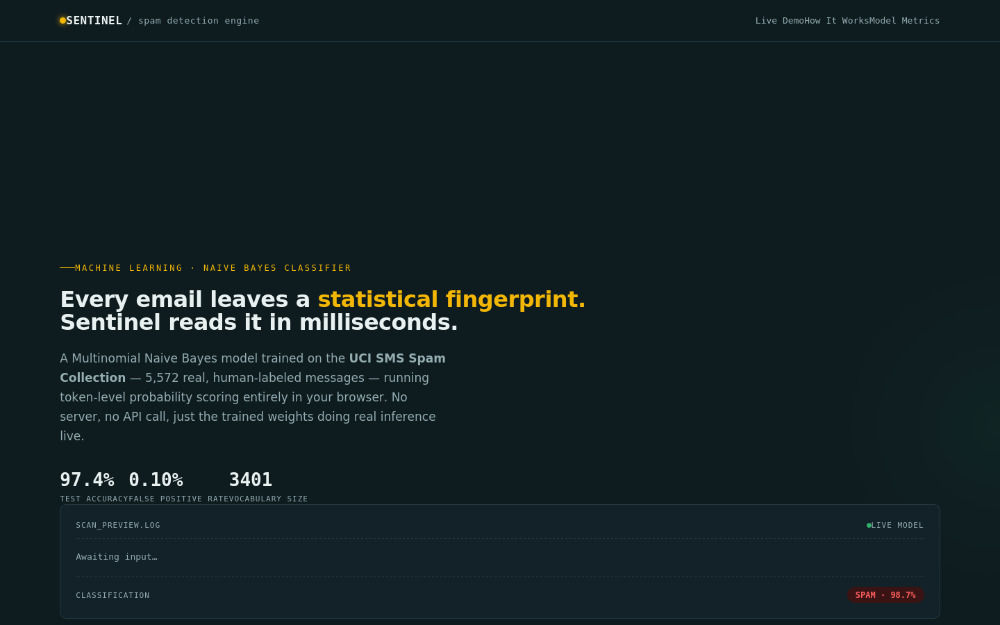
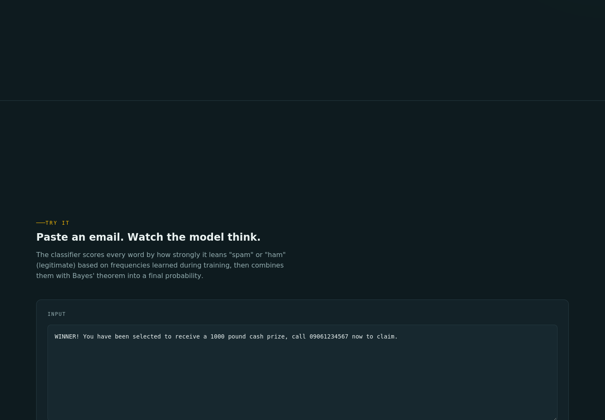
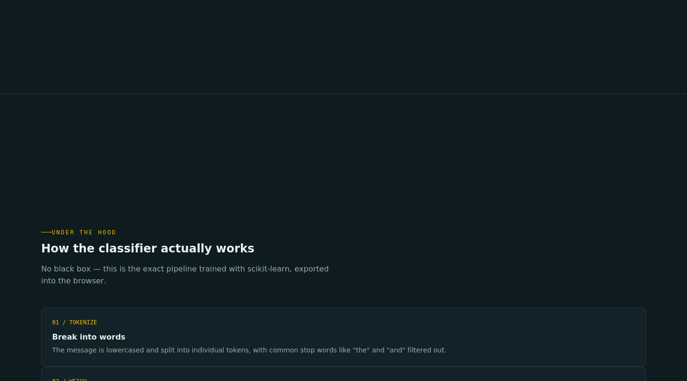

# Sentinel — Message Spam Detector (Machine Learning)

A spam/ham message classifier built with **Multinomial Naive Bayes** and
**TF-IDF vectorization** (scikit-learn), trained on the real **UCI SMS Spam
Collection** dataset (5,572 human-labeled messages), served two ways:

1. **Static, client-side demo** (`index.html`) — the trained model's weights
   are exported to JSON and the exact same TF-IDF + Naive Bayes math runs
   entirely in the browser with vanilla JavaScript (verified to match
   scikit-learn's predictions to 6 decimal places). No backend required;
   deploy it anywhere static files are hosted (GitHub Pages, Netlify, Vercel).
2. **Full-stack REST API** (`app.py`) — a Flask server that loads the trained
   scikit-learn model and exposes a `/api/predict` endpoint, for a more
   traditional client/server architecture.

## Screenshots

**Hero + live token-level scanner**


**Interactive spam checker — paste a message, see the model's reasoning**


**Evaluation metrics + confusion matrix**


## Live demo

Open `index.html` directly in a browser — it's fully self-contained.

## How it works

1. **Dataset** — `dataset.csv` is the UCI SMS Spam Collection: 5,572 real
   messages, 747 spam / 4,825 ham. (`generate_dataset.py` is kept in the repo
   as an alternate synthetic-data generator for experimentation, but the
   shipped model is trained on the real data.)
2. **Training** — `train_model.py` vectorizes text with `TfidfVectorizer`
   (term frequency-inverse document frequency, English stop words removed,
   L2-normalized) and fits a `MultinomialNB` classifier on an 80/20
   stratified train/test split. It computes accuracy, precision, recall, F1,
   ROC-AUC, false positive rate, and a confusion matrix on the held-out test
   set, and saves the fitted pipeline to `model.pkl`.
3. **Export** — `export_to_json.py` extracts the model's learned IDF values
   and per-class log-probabilities and saves them to `model_params.json`,
   which `index.html` embeds directly so the same trained model can
   reproduce the exact TF-IDF + Naive Bayes score client-side (verified to
   match scikit-learn's `predict_proba` to 6 decimal places) — no server
   round-trip needed for the demo.
4. **Serve** — `app.py` is a Flask API that loads `model.pkl` and returns
   predictions over HTTP for `POST /api/predict`, for a conventional
   client/server deployment.

## Results (held-out test set, 1,115 messages)

| Metric | Score |
|---|---|
| Accuracy | 97.4% |
| Precision | 99.2% |
| Recall | 81.2% |
| F1 score | 89.3% |
| ROC-AUC | 0.988 |
| False positive rate | 0.10% (1 of 966 legit messages misflagged) |

TF-IDF weighting shifted the trade-off compared to a plain bag-of-words
count model: precision and false-positive rate improved substantially (only
1 false positive across the whole test set) at the cost of some recall —
i.e. this version is more conservative about calling something spam, which
is usually the right trade-off for a spam filter, since a false positive
(losing a real message) is more costly than a false negative (one spam
message getting through).

## Known limitation (worth knowing, worth saying in an interview)

The model is trained on SMS-style text — short, informal messages. Tested
against longer, formal business email, accuracy drops because the
vocabulary and writing style differ from the training distribution (a
textbook case of **domain shift**). Two ways to fix this, listed under
"Ideas for extending" below: train on an email-specific corpus (e.g.
Enron-Spam), or combine both datasets for broader coverage.

## Project structure

```
.
├── generate_dataset.py    # alt: builds a synthetic dataset.csv
├── dataset.csv             # labeled training data (UCI SMS Spam Collection)
├── train_model.py          # trains & evaluates the Naive Bayes model
├── export_to_json.py       # exports model weights for client-side JS
├── model.pkl                # trained scikit-learn pipeline (backend)
├── model_params.json        # exported weights (frontend)
├── metrics.json             # accuracy / precision / recall / F1 / confusion matrix
├── app.py                   # Flask REST API
├── Dockerfile                # container build for the API
├── render.yaml               # Render.com deployment blueprint
├── requirements.txt
├── assets/                   # README screenshots
└── index.html                # standalone interactive frontend
```

## Run locally (static demo only)

```bash
open index.html
```

## Run locally (full stack)

```bash
pip install -r requirements.txt
python generate_dataset.py     # optional: regenerate dataset
python train_model.py          # trains model.pkl + metrics.json
python export_to_json.py       # refreshes model_params.json for the frontend
python app.py                  # starts Flask on http://localhost:5000
```

### API example

```bash
curl -X POST http://localhost:5000/api/predict \
  -H "Content-Type: application/json" \
  -d '{"text": "WINNER! You have been selected to receive a 1000 pound cash prize, call 09061234567 now to claim."}'
```

```json
{
  "label": "spam",
  "confidence": 0.9908,
  "probability_spam": 0.9908,
  "probability_ham": 0.0092,
  "reason": ["claim", "prize", "1000", "winner", "selected"],
  "threshold": 0.5
}
```

`reason` lists the words that most strongly pushed the message toward its
predicted label, ranked by log-likelihood ratio. `threshold` reports the
decision boundary on P(spam) currently in effect (configurable via the
`SPAM_THRESHOLD` environment variable — see below).

Error responses use a 400 status with an `"error"` field, e.g. for empty
text or text over `MAX_TEXT_LENGTH` characters (20,000 by default).

### Configuration (environment variables)

| Variable | Default | Purpose |
|---|---|---|
| `FLASK_DEBUG` | `0` | Set to `1` to enable Flask's debugger/reloader locally. Leave off (`0`) in any deployed environment — debug mode can leak stack traces and source code to clients. |
| `SPAM_THRESHOLD` | `0.5` | Decision boundary on P(spam). Lowering it trades precision for recall; raising it does the opposite. Tune against the confusion matrix in `metrics.json` rather than guessing. |
| `MAX_TEXT_LENGTH` | `20000` | Maximum characters accepted per request. |
| `PORT` | `5000` | Port Flask listens on. |

### Live demo

_Add your deployed URL here once live, e.g._
`https://sentinel-spam-detector.onrender.com`

## Resume bullet points (verified against this repo's actual metrics)

```
Sentinel — ML-Based Spam Detection System
• Built and trained a Multinomial Naive Bayes spam classifier with TF-IDF
  text vectorization on the UCI SMS Spam Collection (5,572 labeled
  messages) using scikit-learn, achieving 97.4% accuracy, 99.2% precision,
  and a 0.1% false positive rate on a held-out test set
• Exported trained model weights (IDF values + per-class log-probabilities)
  to reproduce exact TF-IDF + Naive Bayes inference client-side in vanilla
  JavaScript, verified to match scikit-learn's predictions to 6 decimal
  places, alongside a Flask REST API for server-side prediction
• Built an interactive web UI visualizing token-level model reasoning
  (per-word spam/ham signal) and evaluation metrics, including a confusion
  matrix
• Containerized the API with Docker and configured for one-click deployment
  to Render
• Tech stack: Python, scikit-learn, Flask, Docker, HTML/CSS/JavaScript
```

Swap in your live URL and GitHub link once deployed. Keep the numbers as
they are here — don't round up. These are the actual numbers this repo
produces; a recruiter or interviewer can clone the repo and re-run
`train_model.py` to get the same result.

## Tech stack

- **Model**: Multinomial Naive Bayes (`scikit-learn`)
- **Features**: TF-IDF via `TfidfVectorizer` (term frequency-inverse document
  frequency, L2-normalized)
- **Backend**: Flask REST API
- **Frontend**: Vanilla HTML/CSS/JS, no build step, runs the trained model
  client-side
- **Evaluation**: accuracy, precision, recall, F1, ROC-AUC, false positive
  rate, confusion matrix on a held-out 20% test split

## Ideas for extending this project

- Add the Enron-Spam email corpus (or combine it with the SMS data) to fix
  the domain-shift limitation above and generalize better to formal email.
- Try a linear SVM or logistic regression baseline for comparison against
  the Naive Bayes model.
- Add persistent storage (SQLite/Postgres) to log predictions and user
  feedback for retraining.
- Containerize the Flask API with Docker and deploy to Render/Fly.io/AWS
  (see `Dockerfile` and `render.yaml` in this repo for a ready-to-go setup).

## Deployment

This repo includes a `Dockerfile` and `render.yaml` for one-click deployment
of the Flask API to [Render](https://render.com):

1. Push this repo to GitHub.
2. On Render: **New → Blueprint**, point it at your repo — `render.yaml` is
   auto-detected and configures the web service.
3. Once deployed, update the `fetch()` URL in `index.html` (if you switch the
   frontend to call the live API instead of running inference client-side)
   to your Render URL, e.g. `https://sentinel-api.onrender.com/api/predict`.
4. For the static, client-side-only version, deploy `index.html` directly to
   **GitHub Pages**: Settings → Pages → deploy from the `main` branch, root
   folder. No backend needed for that version — it's already self-contained.

## License

MIT — free to use for learning, portfolios, and interviews.
